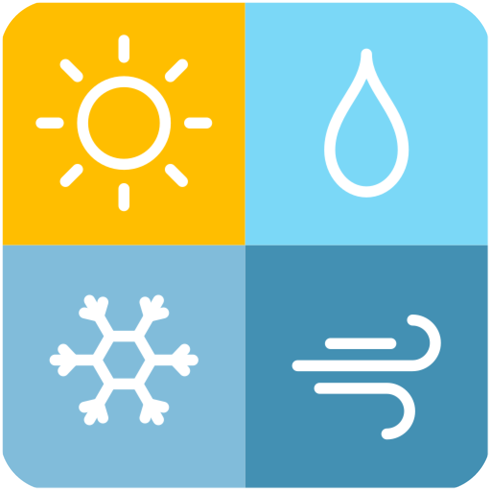

<h1 align="center">
  
</h1>

<p align="center">
  
</p>


## 💻 Project

# weather-forecast-app

iOS weather app integrated with OpenWeather API.

Version of XCode: 16.2

# Team

- Here must contain the names of everyone in the team, at the moment that
  project is created
  - Mobile Developer: Alexandre Marques

## Features

- [ ] View Weather Forecast.

## ✨ Technologies

- [ ] UIKit.
- [ ] ViewCode.

## Link do Figma

https://www.figma.com/file/OczdlZrkU7Z7DyYLLDoiPo/App-Tempo?type=design&node-id=0%3A1&mode=dev

## OpenWeather API

Esse aplicativo integra com a API da OpenWeather. Para fazer a integração você precisará realizar seu cadastro no site da API e gerar a sua chave de acesso que será utilizada nas requisições, conforme demosntrado no projeto.

[One Call API 3.0](https://openweathermap.org/api)

## Running the project

<br />

# Project Structure

```bash
├── assets
│   └── images
├── components
├── hooks
├── navigation
├── screens
├── styles
    └── theme
        └── default-theme
```

<div align="center">
  <small>Developed By Alexandre Marques - 2024/Fev</small>
</div>
